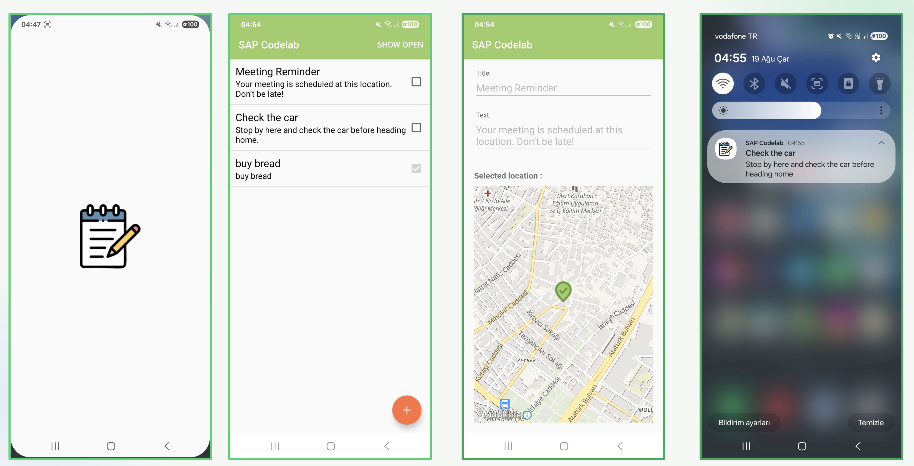
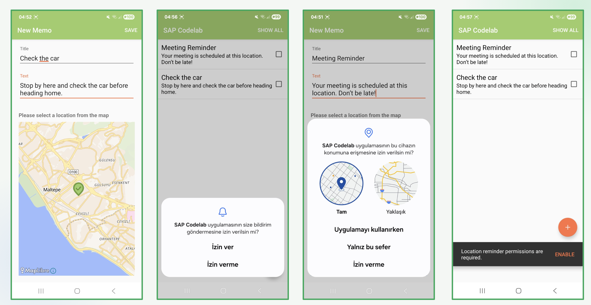

# Location Reminder Android

Android application for creating location-based memo reminders.

Users can select a location on the map while creating a memo. When the user enters the defined area,
the application triggers a notification containing the memo information.

## Screenshots





## Features

- Create and manage memos
- Select reminder locations on a map
- Geofence-based location reminders
- Background notification support
- Runtime permission management
- Room database persistence
- MVVM architecture
- Hilt dependency injection
- Kotlin Coroutines, Flow and StateFlow
- Unit tests for core application layers

## Architecture

The project follows an MVVM-based architecture with a lightweight domain layer.

```text
UI
↓
ViewModel
↓
UseCase
↓
Repository / Managers
↓
Room / Android APIs
```

## Tech Stack

- Kotlin
- Android XML / ViewBinding
- MVVM
- Dagger Hilt
- Room
- Kotlin Coroutines
- Flow / StateFlow
- Google Geofencing API
- MapLibre
- JUnit / MockK

## Notes

This project was developed as an Android coding case.

The existing project structure was preserved where possible, while modern Android development
practices were applied without introducing unnecessary architectural complexity.
